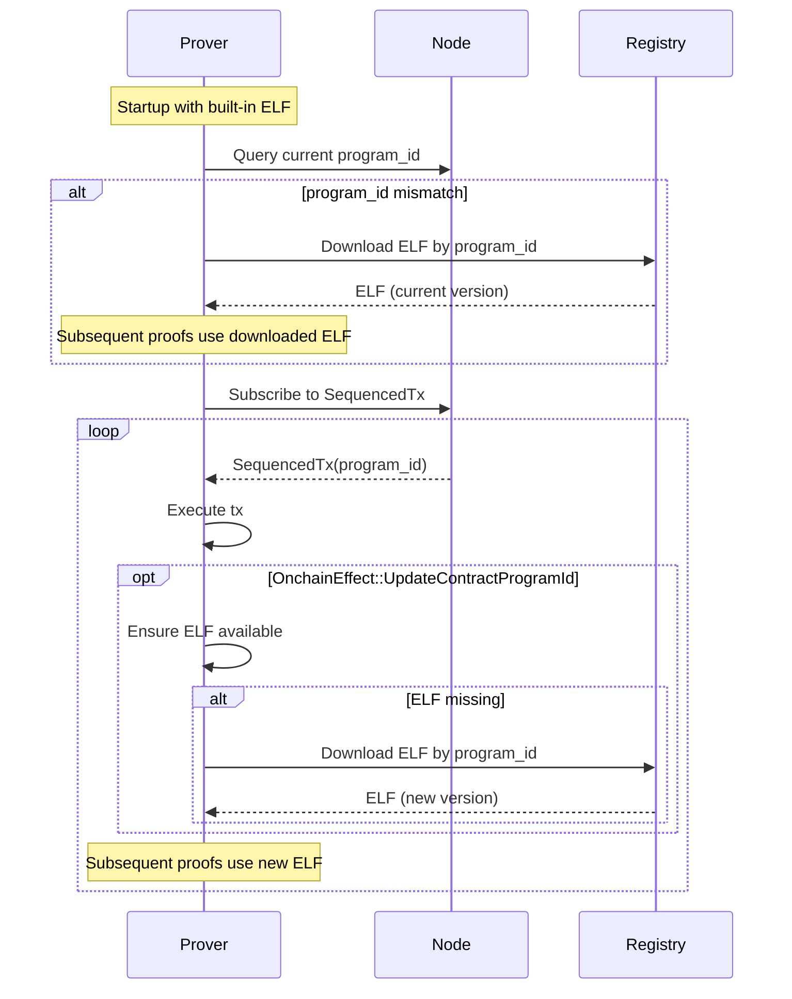

# Sequence Diagram

This diagram captures contract upgrade flow and how the prover fetches and uses updated ELF versions while proving sequenced transactions.

```mermaid
sequenceDiagram
          participant Prover
          participant Node
          participant Registry

          Note over Prover: Startup with built-in ELF
          Prover->>Node: Query current program_id
          alt program_id mismatch
              Prover->>Registry: Download ELF by program_id
              Registry-->>Prover: ELF (current version)
          Note over Prover: Subsequent proofs use downloaded ELF
          end


          Prover->>Node: Subscribe to SequencedTx

          loop
            Node-->>Prover: SequencedTx(program_id)
            Prover->>Prover: Execute tx
            opt OnchainEffect::UpdateContractProgramId
                Prover->>Prover: Ensure ELF available
                alt ELF missing
                    Prover->>Registry: Download ELF by program_id
                    Registry-->>Prover: ELF (new version)
                end
            end
            Note over Prover: Subsequent proofs use new ELF
          end
```
